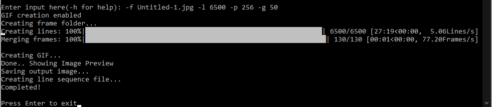

# Thread-Art
Simulation of string art using Python. To view full project details; visit [my website](https://itskevcc.space/2020/10/15/weaving-art/)

To use, install the necessary libraries and run the script

Open the file in cmd prompt, and follow the instructions

Usage in cmd prompt: -f 'FILE_PATH' -l 'LINE_NUMBER' -p 'PIN_NUMBER' -g(optional) 'LINE_PER_FRAME'

where \
      f = destination file path\
      l = the number of lines on the picture\
      p = the number of pins required\
      g = the LPF (number of lines/frame) of the gif created (leave blank if GIF not needed)\

Eg: python WeaveAlg -f C:\\Users\\chuch\\Desktop\\TESTPIC.jpg -l 2500 -p 256 -g 10\
Eg: python WeaveAlg -f abc.jpg -l 5000 -p 20 -g 30\
Eg: python WeaveAlg -f cat.jpg -l 2345 -p 256\
Note: File path must end with .jpg, .jpeg or .png extensions

Code when run in Command Prompt:

Feel free to <a href="mailto:contact@itskevcc.space">contact me</a> if you have any doubts or questions!
